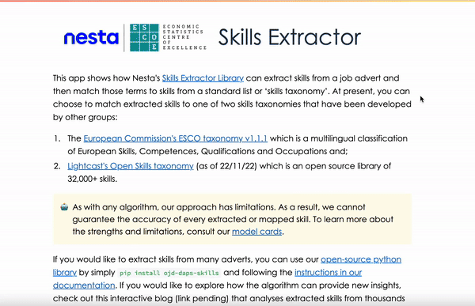

# Skills Extractor

- [Installation](#installation)
- [Using Nesta’s Skills Extractor library](#tldr-using-nestas-skills-extractor-library)
- Development

## Welcome to Nesta’s Skills Extractor Library

Welcome to the documentation of Nesta’s skills extractor library.

This page contains information on how to install and use Nesta’s skills extraction library. The skills library allows you to extract skills phrases from job advertisement texts and maps them onto a skills taxonomy of your choice.


We currently support three different taxonomies to map onto: the European Commission’s European Skills, Competences, and Occupations (ESCO), Lightcast’s Open Skills and a “toy” taxonomy developed internally for the purpose of testing.

If you’d like to learn more about the models used in the library, please refer to the model card page.

You may also want to read more about the wider project by reading:

1. [Our Introduction blog](https://www.escoe.ac.uk/the-skills-extractor-library)
2. [Our interactive analysis blog](https://www.nesta.org.uk/data-visualisation-and-interactive/exploring-uk-skills-demand/)

## Installation

You can use pip to install the library:

`pip install ojd-daps-skills`

You will also need to install spaCy’s English language model:

`python -m spacy download en_core_web_sm`

Note that this package was developed on MacOS and tested on Ubuntu. Changes have been made to be compatible on a Windows system but are not tested and cannot be guaranteed.

When the package is first used it will automatically download a folder of neccessary data and models. (~1GB)

## TL;DR: Using Nesta’s Skills Extractor library

To extract skills from a job advert:

```
from ojd_daps_skills.extract_skills.extract_skills import SkillsExtractor

sm = SkillsExtractor(taxonomy_name="toy")

✘ nestauk/en_skillner NER model not loaded. Downloading model...
Collecting en-skillner==any
  Downloading https://huggingface.co/nestauk/en_skillner/resolve/main/en_skillner-any-py3-none-any.whl (587.7 MB)
     ━━━━━━━━━━━━━━━━━━━━━━━━━━━━━━━━━━━━━━━ 587.7/587.7 MB 5.1 MB/s eta 0:00:0000:0100:01
Installing collected packages: en-skillner
Successfully installed en-skillner-3.7.1
✘ Multi-skill classifier not loaded. Downloading model...
Fetching 4 files: 100%|██████████| 4/4 [00:00<00:00, 26843.55it/s]
✘ Neccessary data files are not downloaded. Downloading ~0.5GB of
neccessary data files to
/Users/india.kerlenesta/Projects/nesta/ojd_daps/ojd_daps_extension/ojd_daps_skills/ojd_daps_skills_data.
ℹ Data folder downloaded from
/Users/india.kerlenesta/Projects/nesta/ojd_daps/ojd_daps_extension/ojd_daps_skills/ojd_daps_skills_data

job_ads = [
    "The job involves communication skills and maths skills",
    "The job involves Excel skills. You will also need good presentation skills",
    "You will need experience in the IT sector.",
]
job_ad_with_skills = sm(job_ads)

ℹ Getting embeddings for 3 texts ...
ℹ Took 0.018199920654296875 seconds
```

To access the extracted and mapped skills for each inputted job advert:

```
for job_ad_with_skills_doc in job_ad_with_skills:
  print(f"Job advert: {job_ad_with_skills_doc}")
  # print raw ents (i.e. multiskills are not split, also include 'BENEFIT' and 'EXPERIENCE' spans)
  print(f"Entities found: {[(ent.text, ent.label_) for ent in job_ad_with_skills_doc.ents]}")
  # print SKILL spans (where SKILL spans are predicted as multiskills, split them)
  print(f"Skill spans: {job_ad_with_skills_doc._.skill_spans}")
  # print mapped skills to the "toy" taxonomy
  print(f"Skills mapped: {job_ad_with_skills_doc._.mapped_skills}")
  print("\n")
```

Which returns:

```
Job advert: The job involves communication skills and maths skills
Entities found: [('communication skills', 'SKILL'), ('maths', 'SKILL')]
Skill spans: [communication skills, maths]
Skills mapped: [{'ojo_skill': 'communication skills', 'ojo_skill_id': 3144285826919113, 'match_skill': 'communication, collaboration and creativity', 'match_score': 0.75, 'match_type': 'most_common_level_1', 'match_id': 'S1'}, {'ojo_skill': 'maths', 'ojo_skill_id': 2887431344496880, 'match_skill': 'working with computers', 'match_score': 0.75, 'match_type': 'most_common_level_1', 'match_id': 'S5'}]


Job advert: The job involves Excel skills. You will also need good presentation skills
Entities found: [('Excel', 'SKILL'), ('presentation skills', 'SKILL')]
Skill spans: [Excel, presentation skills]
Skills mapped: [{'ojo_skill': 'Excel', 'ojo_skill_id': 2576630861021310, 'match_skill': 'use spreadsheets software', 'match_score': 0.7379249448453751, 'match_type': 'skill', 'match_id': 'abcd'}, {'ojo_skill': 'presentation skills', 'ojo_skill_id': 1846141317334203, 'match_skill': 'communication, collaboration and creativity', 'match_score': 0.5, 'match_type': 'most_common_level_1', 'match_id': 'S1'}]


Job advert: You will need experience in the IT sector.
Entities found: [('experience in the IT sector', 'EXPERIENCE')]
Skill spans: []
Skills mapped: []
```

## App



If you would like to demo the library using a front end, we have also built a streamlit app that allows you to extract skills for a given text. The app allows you to paste a job advert of your choice, extract and map skills onto any of the configurations: extract_skills_lightcast and extract_skills_esco.

## Contributor guidelines

The technical and working style guidelines can be found [here](https://github.com/nestauk/ds-cookiecutter/blob/master/GUIDELINES.md).

If contributing, changes will need to be pushed to a new branch in order for our code checks to be triggered.

